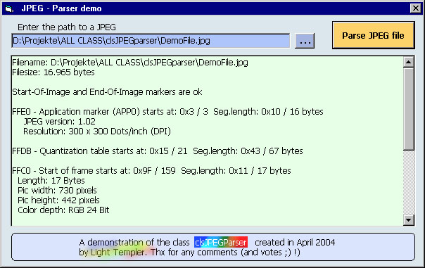



## A Full JPEG Parser Class \_\_\_UPDATE\-1

### Description

A selfcontained class done from scratch to parse the segments of a JPEG file and get many informations (like the TRUE size (width / height) of the image when there is a Adobe PhotoShop (TM) preview included ..., start of the segments, parseable without errors and so on) 

----

Comments are welcome, votes are motivating - thx for! ___LiTe

----

UPDATE-1

----

Now demo app shows parsing so far AND error message, if an error occurs. Will recognize all kind of progressive and hierachical Start-Of-Frames now. Decided to don't use API CopyMem because of easier bounding checks in pure VB.
 
### More Info
 

             |
---                |---
**Submitted On**   |2004-04-23 15:15:36
**By**             |[Light Templer](https://github.com/Planet-Source-Code/PSCIndex/blob/master/ByAuthor/light-templer.md)
**Level**          |Advanced
**User Rating**    |5.0 (75 globes from 15 users)
**Compatibility**  |VB 5\.0, VB 6\.0
**Category**       |[Graphics](https://github.com/Planet-Source-Code/PSCIndex/blob/master/ByCategory/graphics__1-46.md)
**World**          |[Visual Basic](https://github.com/Planet-Source-Code/PSCIndex/blob/master/ByWorld/visual-basic.md)
**Archive File**   |[A\_Full\_JPE1737374252004\.zip](https://github.com/Planet-Source-Code/light-templer-a-full-jpeg-parser-class-update-1__1-53311/archive/master.zip)

